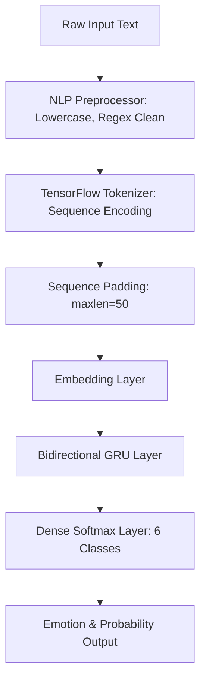

<div align="center">

# 🎭 Moodline — Real-Time Emotion Classification

**An interactive NLP web application and deep learning engine powered by a Bidirectional GRU (BiGRU) neural network.**

[](https://mood-detection-nqcv.onrender.com/)
[](https://www.python.org/)
[](https://fastapi.tiangolo.com/)
[](https://www.tensorflow.org/)
[](https://keras.io/)
[](LICENSE)

<br/>

[🌐 Live Demo](https://mood-detection-nqcv.onrender.com/) •
[Key Features](#-key-features) •
[Model Benchmarks](#-model-architecture--benchmarks) •
[Tech Stack](#-tech-stack) •
[Quickstart](#-quickstart--installation) •
[API Reference](#-api-reference) •
[Project Structure](#-project-structure)

</div>

---

## 📌 Overview

**Moodline** is an end-to-end Natural Language Processing (NLP) system designed to detect human emotions from raw text with high precision. By combining a fine-tuned **Bidirectional Gated Recurrent Unit (BiGRU)** neural network with an asynchronous **FastAPI** backend and a bespoke, sleek front-end console, Moodline delivers real-time sentiment analysis and full multi-class emotion probability breakdowns.

The model classifies input text into six core emotional states:

| Emotion | Indicator | Description |
| :--- | :---: | :--- |
| **Sadness** | 😢 | Melancholy, grief, disappointment, or feeling low |
| **Joy** | 😄 | Happiness, delight, optimism, and excitement |
| **Love** | ❤️ | Affection, warmth, gratitude, and deep connection |
| **Anger** | 😠 | Frustration, annoyance, hostility, or rage |
| **Fear** | 😨 | Anxiety, panic, apprehension, or uncertainty |
| **Surprise** | 😲 | Astonishment, amazement, shock, or wonder |

---

## 🌐 Live Deployment

Moodline is deployed live on **Render**:

- 🚀 **Live Web Application**: [https://mood-detection-nqcv.onrender.com/](https://mood-detection-nqcv.onrender.com/)
- 📖 **Interactive Swagger Docs**: [https://mood-detection-nqcv.onrender.com/docs](https://mood-detection-nqcv.onrender.com/docs)
- 🔍 **ReDoc Specifications**: [https://mood-detection-nqcv.onrender.com/redoc](https://mood-detection-nqcv.onrender.com/redoc)

> [!NOTE]
> The app is hosted on Render's free web service tier. If the service has been idle, the initial request may take ~30 seconds while the container spins up.

---

## ✨ Key Features

- **🚀 High-Accuracy BiGRU Engine**: Captures contextual nuance by reading text sequences in both forward and backward directions, reaching **~93% test accuracy**.
- **⚡ Fast & Async FastAPI Server**: Instant inference response times with lightweight `tensorflow-cpu` optimizations and Pydantic validation.
- **🧠 Efficient Lifespan Memory Management**: Models and tokenizers are loaded into memory asynchronously on startup and cleanly released on shutdown.
- **🎨 Glassmorphism Interactive UI**: Includes an animated mood orb, dynamic multi-bar probability visualizers, live server health pinging, and keyboard shortcuts (`Cmd / Ctrl + Enter`).
- **📊 Detailed Probability Distribution**: Displays confidence scores for the top emotion alongside a full probability breakdown across all 6 emotion classes.
- **🛠️ Automated Text Normalization**: Built-in preprocessing pipeline that handles apostrophes, punctuation stripping, case folding, and post-padding to max sequence length.

---

## 🔬 Model Architecture & Benchmarks

During the experimental phase documented in [`Emotion_Classification.ipynb`](file:///Users/ankurmehta/Desktop/Projects/NLP%20Project/EmotionClassification/Emotion_Classification.ipynb), multiple recurrent neural network architectures were implemented, trained, and benchmarked under identical conditions:

### 📈 Model Comparison

| Architecture | Forward/Backward Context | Test Accuracy | Status |
| :--- | :---: | :---: | :---: |
| **Simple RNN** | Uni-directional | ~19.3% | Baseline |
| **Standard LSTM** | Uni-directional | ~27.5% | Experimental |
| **Standard GRU** | Uni-directional | ~28.0% | Experimental |
| **Bidirectional GRU (BiGRU)** | **Bi-directional** | **~92.6%** | **Selected Model 🏆** |

### 🏗️ BiGRU Pipeline



---

## 🛠️ Tech Stack

| Layer | Technologies Used |
| :--- | :--- |
| **Deep Learning / Machine Learning** | Python 3.10+, TensorFlow 2.17 (Keras), NumPy, Pickle |
| **Backend API** | FastAPI, Uvicorn, Pydantic v2 |
| **Frontend Web Console** | Vanilla HTML5, Modern CSS (Glassmorphism, Variables, Animations), JavaScript ES6+ |
| **Cloud & Deployment** | Render (Cloud Web Service) |
| **Fonts & Typography** | Google Fonts (*Fraunces*, *Space Grotesk*, *JetBrains Mono*) |

---

## 📂 Project Structure

```bash
EmotionClassification/
├── main.py                      # FastAPI server application & inference API
├── BiGRU_Modle.keras            # Trained Keras BiGRU neural network model
├── tokenizer.pkl                # Pickled TensorFlow Keras text tokenizer
├── Emotion_Classification.ipynb # Research notebook (data cleaning, training, evaluation)
├── requirements.txt             # Project Python dependencies
└── static/                      # Frontend UI static web assets
    ├── index.html               # Main Moodline web console interface
    ├── style.css                # Custom glassmorphism design system & styles
    ├── script.js                # Asynchronous API integration & UI state script
    ├── logo.svg                 # Brand SVG application logo
    └── favicon.svg              # Browser tab icon
```

---

## 🚀 Quickstart & Installation

Follow these steps to run **Moodline** locally on your machine.

### Prerequisites

- **Python**: `3.10` or higher
- **pip** package manager

### 1. Clone the Repository

```bash
git clone https://github.com/ankurmehtax2007-stack/Mood-detection.git
cd Mood-detection
```

### 2. Set Up a Virtual Environment

```bash
# macOS/Linux
python3 -m venv venv
source venv/bin/activate

# Windows (Command Prompt / PowerShell)
python -m venv venv
venv\Scripts\activate
```

### 3. Install Dependencies

```bash
pip install --upgrade pip
pip install -r requirements.txt
```

### 4. Launch the Application

Start the FastAPI application using Uvicorn:

```bash
uvicorn main:app --host 0.0.0.0 --port $PORT
```

Once running, open your browser and navigate to:
- 🌐 **Web Console Interface**: [http://localhost:8000](http://localhost:8000)
- 📖 **Interactive API Specs (Swagger UI)**: [http://localhost:8000/docs](http://localhost:8000/docs)
- 🔍 **ReDoc Specifications**: [http://localhost:8000/redoc](http://localhost:8000/redoc)

---

## 📡 API Reference

### 1. Health Check

Verifies server status and model loading state.

- **Endpoint**: `GET /health`
- **Response**:
```json
{
  "status": "Server is running",
  "model_loaded": true
}
```

---

### 2. Predict Emotion

Analyzes text input and predicts the underlying emotion.

- **Endpoint**: `POST /predict`
- **Content-Type**: `application/json`

#### Request Body
```json
{
  "text": "I can't believe we actually pulled this off, I'm so thrilled!"
}
```

#### Response (200 OK)
```json
{
  "text": "I can't believe we actually pulled this off, I'm so thrilled!",
  "predicted_emotion": "joy",
  "confidence": 0.9642,
  "all_probabilites": {
    "sadness": 0.0031,
    "joy": 0.9642,
    "love": 0.0125,
    "anger": 0.0084,
    "fear": 0.0048,
    "surprise": 0.0070
  }
}
```

#### Example Usage via cURL
```bash
curl -X 'POST' \
  'http://localhost:8000/predict' \
  -H 'accept: application/json' \
  -H 'Content-Type: application/json' \
  -d '{"text": "I am feeling extremely nervous about tomorrow."}'
```

---

## 💻 Notebook & Training Workflow

To explore the raw data, train alternative models, or reproduce the training pipeline:

1. Open [`Emotion_Classification.ipynb`](file:///Users/ankurmehta/Desktop/Projects/NLP%20Project/EmotionClassification/Emotion_Classification.ipynb) in Jupyter Notebook or VS Code.
2. Step through the notebook cells:
   - **Data Cleaning & Tokenization**: Preprocess text corpora.
   - **Baseline Training**: Simple RNN, LSTM, and GRU comparisons.
   - **BiGRU Architecture Tuning**: Train the final bidirectional network.
   - **Model Export**: Save the trained model to `.keras` and tokenizer to `.pkl`.

---

## 📄 License

Distributed under the MIT License. See `LICENSE` for more information.

---

<div align="center">
  <sub>Crafted with ❤️ and TensorFlow by Ankur Mehta</sub>
</div>
